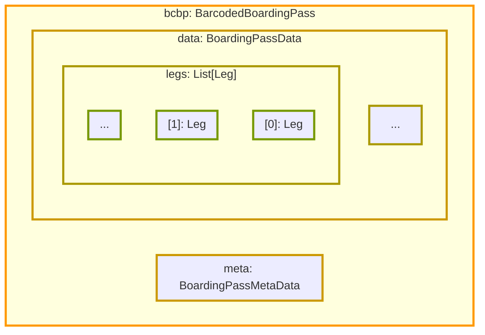

# IATA BCBP

[](https://github.com/jqssun/iata-api/stargazers)
[](https://pypi.org/project/iata/)
[](https://github.com/jqssun/iata-api/blob/main/LICENSE)

A Python library and API for encoding and decoding IATA Bar Coded Boarding Pass (BCBP) data, compliant with the current version of [IATA Resolution 792](https://www.iata.org/en/programs/passenger/common-use/). This API is used by [this service](https://github.com/jqssun/iata-web) hosted at [jqs.app/iata](https://jqs.app/iata).


> [!TIP]
> This library is designed to be backwards compatible with older versions of the specification. If you notice a discrepancy or would like to propose a fix, please feel free to submit a pull request. For specification updates or boarding passes that cannot be decoded, please contact the author via the git commit email.

## Usage

### Example

```python
# %pip install iata
from iata.bcbp import BarcodedBoardingPass, BoardingPassMetaData, BoardingPassData, Leg, decode, encode
from datetime import datetime, timezone
reference_year = 1970

# Example from BCBP Implementation Guide (Version 8)
boarding_pass = BarcodedBoardingPass(
    meta=BoardingPassMetaData(
        version_number=2,
    ),
    data=BoardingPassData(
        passenger_name="DESMARAIS/LUC",
        legs=[
            Leg(
                operating_carrier_pnr_code="ABC123",
                from_city_airport_code="YUL",
                to_city_airport_code="FRA",
                operating_carrier_designator="AC",
                flight_number="834",
                date_of_flight=datetime(reference_year, 8, 14, tzinfo=timezone.utc),
                compartment_code="F",
                seat_number="1A",
                check_in_sequence_number="25",
                passenger_status="1",
            )
        ],
        security_data="GIWVC5EH7JNT684FVNJ91W2QA4DVN5J8K4F0L0GEQ3DF5TGBN8709HKT5D3DW3GBHFCVHMY7J5T6HFR41W2QA4DVN5J8K4F0L0GE"
    )
)
encoded = encode(boarding_pass)
assert encoded == "M1DESMARAIS/LUC       EABC123 YULFRAAC 0834 226F001A0025 100^164GIWVC5EH7JNT684FVNJ91W2QA4DVN5J8K4F0L0GEQ3DF5TGBN8709HKT5D3DW3GBHFCVHMY7J5T6HFR41W2QA4DVN5J8K4F0L0GE"
decoded = decode(encoded, reference_year=reference_year)
```

### Routes

```sh
pip install -r requirements.txt
python main.py
```
Access API routes at `http://0.0.0.0:8000/iata/api/{encode,decode}`.

### Methods

- [`encode(bcbp: BarcodedBoardingPass) -> str`](./iata/bcbp/encode.py)
- [`decode(barcode_string: str, reference_year: int) -> BarcodedBoardingPass`](./iata/bcbp/decode.py)

### Models



All field names are consistent with those defined in the BCBP Implementation Guide. Fields can either be mandatory (M) or conditional (C).

1. [`BoardingPassMetaData`](./iata/bcbp/models.py)

| Field                          | Type | M,C | Values                                                   |
|--------------------------------|------|-----|----------------------------------------------------------|
| `version_number`               | int  | C   | `1`–`9`                                                  |
| `format_code`                  | str  | M   | `M` multiple                                             |
| `number_of_legs_encoded`       | int  | M   | `1`–`4`                                                  |
| `electronic_ticket_indicator`  | str  | M   | `E` electronic ticket <br> `L` ticketless                |
| `beginning_of_version_number`  | str  | C   | `>`                                                      |
| `beginning_of_security_data`   | str  | C   | `^`                                                      |

2. [`BoardingPassData`](./iata/bcbp/models.py)

| Field                                                      | Type     | M,C | Values                                                   |
|------------------------------------------------------------|----------|-----|----------------------------------------------------------|
| `passenger_name`                                           | str      | M   | `[surname]/[given_name]`                                 |
| `passenger_description`                                    | str      | C   | `0` adult <br> `1` male <br> `2` female <br> `3` child <br> `4` infant <br> `5` no passenger (cabin baggage) <br> `6` adult traveling with infant <br> `7` unaccompanied minor <br> `8` undisclosed <br> `9` unspecified <br> `A`-`Z` future industry use                           |
| `source_of_check_in`                                       | str      | C   | `W` web <br> `K` airport kiosk <br> `R` remote or off-site kiosk <br> `M` mobile device <br> `O` airport agent <br> `T` town agent <br> `V` third party vendor <br> `A` automated check-in |
| `source_of_boarding_pass_issuance`                         | str      | C   | `W` web printed <br> `K` airport kiosk printed <br> `X` transfer kiosk printed <br> `R` remote or off-site kiosk printed <br> `M` mobile device printed <br> `O` airport agent printed |
| `date_of_issue_of_boarding_pass`                           | datetime | C   | `[julian_date]` (YDDD)                                   |
| `document_type`                                            | str      | C   | `B` boarding pass <br> `I` itinerary receipt             |
| `airline_designator_of_boarding_pass_issuer`               | str      | C   | `[airline_code]`                                         |
| `baggage_tag_licence_plate_number`                         | str      | C   | `[0-9][carrier_code][serial_number][consecutive_number]` |
| `first_non_consecutive_baggage_tag_licence_plate_number`   | str      | C   | `[0-9][carrier_code][serial_number][consecutive_number]` |
| `second_non_consecutive_baggage_tag_licence_plate_number`  | str      | C   | `[0-9][carrier_code][serial_number][consecutive_number]` |
| `type_of_security_data`                                    | str      | C   | `1`                                                      |
| `security_data`                                            | str      | C   | `[digital_signature]`                                    |
| `legs`                                                     | list     | M   |                                                          |

3. [`Leg`](./iata/bcbp/models.py)

| Field                                      | Type     | M,C | Values                |
|--------------------------------------------|----------|-----|-----------------------|
| `operating_carrier_pnr_code`               | str      | M   | `[record_locator]`    |
| `from_city_airport_code`                   | str      | M   | `[airport_code]`      |
| `to_city_airport_code`                     | str      | M   | `[airport_code]`      |
| `operating_carrier_designator`             | str      | M   | `[airline_code]`      |
| `flight_number`                            | str      | M   |                       |
| `date_of_flight`                           | datetime | M   | `[julian_date]` (DDD) |
| `compartment_code`                         | str      | M   | `R` supersonic <br> `P` first class premium <br> `F` first class <br> `A` first class discounted <br> `J` business class premium <br> `C` business class <br> `D`, `I`, `Z` business class discounted <br> `W` economy/coach premium <br> `S`, `Y` economy/coach <br> `B` economy/coach discounted <br> `H`, `K`, `L`, `M`, `N`, `Q`, `T`, `V`, `X` economy/coach discounted  |
| `seat_number`                              | str      | M   | `[seat_number]` <br> `INF` infant |
| `check_in_sequence_number`                 | str      | M   |                       |
| `passenger_status`                         | str      | M   | `0` ticket issuance/passenger not checked in <br> `1` ticket issuance/passenger checked in <br> `2` baggage checked/passenger not checked in <br> `3` baggage checked/passenger checked in <br> `4` passenger passed security check <br> `5` passenger passed gate exit (coupon used) <br> `6` transit <br> `7` standby (seat number to be printed) <br> `8` boarding data validation done <br> `9` original boarding line used at time of ticket issuance <br> `A` up- or down-grading required at close out <br> `B`-`Z` reserved for future industry use |
| `airline_numeric_code`                     | str      | C   | `[carrier_code]`     |
| `document_form_serial_number`              | str      | C   | `[airline_code][form_code][serial_number]` |
| `selectee_indicator`                       | str      | C   | `0` not selectee <br> `1` selectee <br> `3` known passenger |
| `international_documentation_verification` | str      | C   | `0` verification not required <br> `1` verification required <br> `2` verification performed |
| `marketing_carrier_designator`             | str      | C   | `[airline_code]`      |
| `frequent_flyer_airline_designator`        | str      | C   | `[airline_code]`      |
| `frequent_flyer_number`                    | str      | C   |                       |
| `id_ad_indicator`                          | str      | C   | `0` industry discount network positive space <br> `1` industry discount network space available <br> `2` industry discount benefit positive space <br> `3` industry discount benefit space available <br> `4` agent discount <br> `5` discount government <br> `6` discount military <br> `7` global employee <br> `8` international government <br> `9` registration group <br> `A` user discount <br> `B` industry discount no classification <br> `C` industry discount frequent search positive space <br> `D` industry discount frequent search space available <br> `E` industry discount reduced positive space <br> `F` industry discount reduced space available <br> `G`-`Z` for future industry use |
| `free_baggage_allowance`                   | str      | C   | `[0-9][0-9][K]` kilograms <br> `[0-9][0-9][L]` pounds <br> `[0-9][PC]` number of pieces |
| `fast_track`                               | bool     | C   | `Y` yes <br> `N` no <br> `[ ]` unqualified |
| `for_individual_airline_use`               | str      | C   |                       |

## References
- IATA Resolution 722: Ticket
- IATA Resolution 728: Code Designators for Passenger Ticket
- IATA Resolution 792: Bar Coded Boarding Pass (BCBP)
- IATA Resolution 1788: Ticketing and Baggage Regulations for Free and Reduced Transportation
